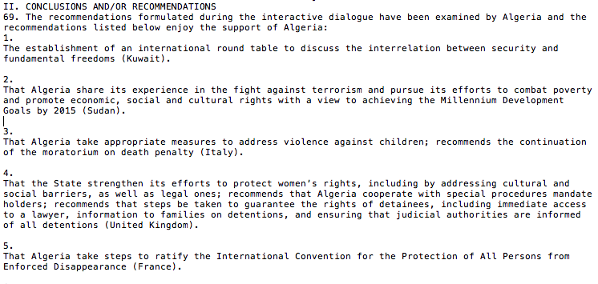
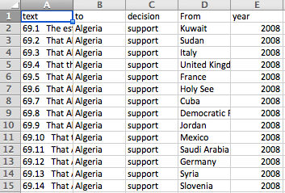

# python-intensive

### Schedule:

[Day 1](https://github.com/dlab-berkeley/python-intensive/tree/master/Day_1): Tue, August 16, 2016 - 9:30 AM to 12:30 PM, Barrows 356: D-Lab Convening Room [(Register)](http://dlab.berkeley.edu/training/python-everything-part-0-0)

[Day 2](https://github.com/dlab-berkeley/python-intensive/tree/master/Day_2): Wed, August 17, 2016 - 9:30 AM to 12:30 PM, Barrows 356: D-Lab Convening Room [(Register)](http://dlab.berkeley.edu/training/python-everything-part-1-1)

[Day 3](https://github.com/dlab-berkeley/python-intensive/tree/master/Day_3): Thu, August 18, 2016 - 9:30 AM to 12:30 PM, Barrows 356: D-Lab Convening Room [(Register)](http://dlab.berkeley.edu/training/python-everything-part-2-1)

[Day 4](https://github.com/dlab-berkeley/python-intensive/tree/master/Day_4): Fri, August 19, 2016 - 9:30 AM to 12:30 PM, Barrows 356: D-Lab Convening Room [(Register)](http://dlab.berkeley.edu/training/python-everything-part-3-1)

### Credits:

- Much of these materials were adapted from those produced by [Software Carpentry](http://software-carpentry.org/). Thank you!

### Project: Using Python for Information Retrieval

In this unit, we'll use python to turn a bunch of loose text documents into a real-life database. (Note: This database was created for a project by R. Terman and E. Voeten, and was processed using much the same process as you'll be learning here.)

The lecture and problem set will leverage your new python skills, especially working with text, lists, and dictionaries; writing for-loops, conditional statements, and functions; and "thinking" like a programmer.

**About the Data**

We'll be creating a database from [Universal Period Review outcome reports](http://www.ohchr.org/EN/HRBodies/UPR/Pages/BasicFacts.aspx).

The Universal Periodic Review (UPR) is a process run by the United Nations Human Rights Council, which involves a periodic review of the human rights records of all 193 UN Member States.

Reviews take place through an interactive discussion between the State under review and other UN Member States. During this discussion any UN Member State can pose questions, comments and/or make recommendations to the States under review. States under review can then respond, stating which recommendations they reject, accept, will consider, etc. Reports are then drawn up detailing this discussion.

We will be analyzing outcome reports from the 2014 Universal Period Reviews of 42 countries, which we retrieved [here](http://www.ohchr.org/EN/HRBodies/UPR/Pages/Documentation.aspx) and formatted as text documents.

The goal is to convert these semi-structured texts to a tabular dataset of **recommendations** with the following variables:

1. Text of recommendation (*text*)
2. Country to which the recommendation is directed (*to*)
3. Country that is making the recommendation (*from*)
4. The year when the review took place (*year*)
5. The response to the recommendation, i.e. whether the reviewed country rejects, accepts, etc (*decision*)

In other words, we want to turn this:

into this:

